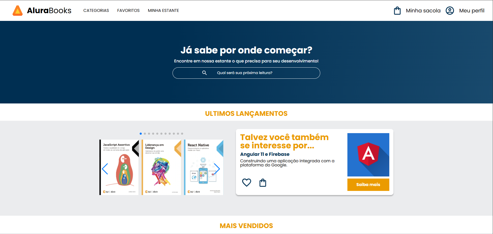

# AluraBook

## 📑 Descrição

O **AluraBook** é um projeto desenvolvido como parte dos estudos realizados na plataforma Alura. A proposta foi criar uma interface de uma livraria online, aplicando conceitos de HTML e CSS modernos, além de boas práticas de estruturação de código e estilização.

O site possui uma interface limpa, objetiva e bem estruturada, com foco em oferecer uma boa experiência de navegação para os usuários. Contém barra de navegação, destaques, seção de livros, carrossel, vantagens da plataforma, além de rodapé informativo.

## 🚀 Tecnologias Utilizadas

- HTML5
- CSS3
- Google Fonts (para tipografia)
- Flexbox e Grid Layout
- Responsividade para diferentes dispositivos (mobile, tablet e desktop)

## 🎯 Funcionalidades

-  Layout completo com cabeçalho, conteúdo e rodapé
-  Design moderno e minimalista
-  Barra de navegação funcional
-  Seção de destaques e promoções
-  Cards com informações dos livros
-  Responsividade total — se adapta perfeitamente a celulares, tablets e desktops
-  Acesso rápido às seções da página

## 🎨 Layout e Design

O projeto foi desenvolvido com foco na construção de uma interface agradável e intuitiva, utilizando cores, espaçamentos e tipografia que proporcionam uma boa hierarquia visual. O CSS foi estruturado de forma limpa, fazendo uso de recursos como variáveis, Flexbox e Grid, garantindo uma experiência consistente em diferentes dispositivos.

## 🔗 Acesso ao Projeto

Acesse o projeto diretamente pelo GitHub Pages clicando no link abaixo:

[🔗 Acessar Projeto](https://alura-book-rouge.vercel.app/)
